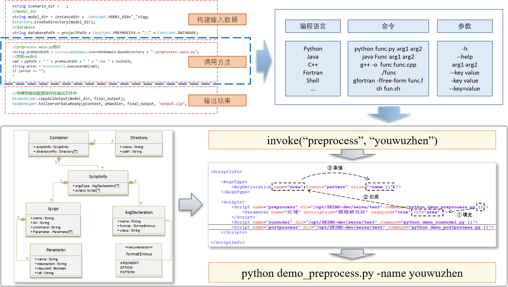
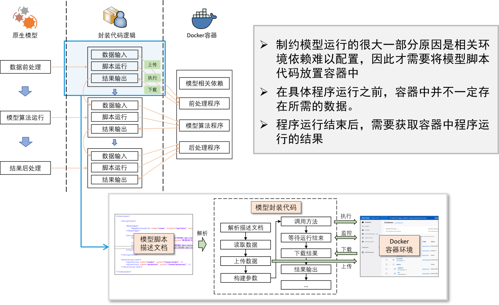
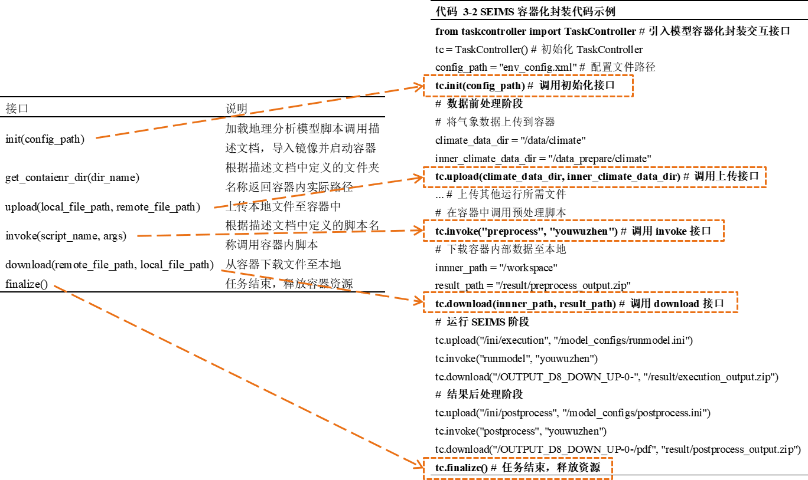
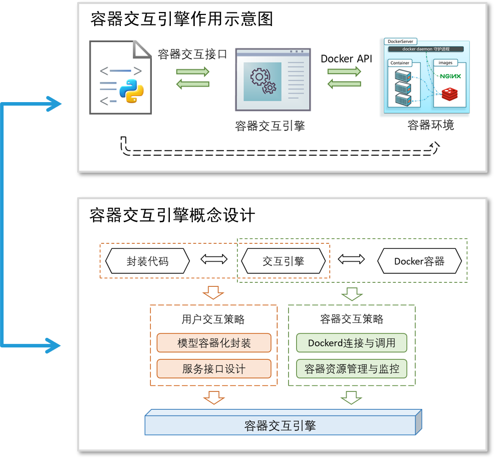
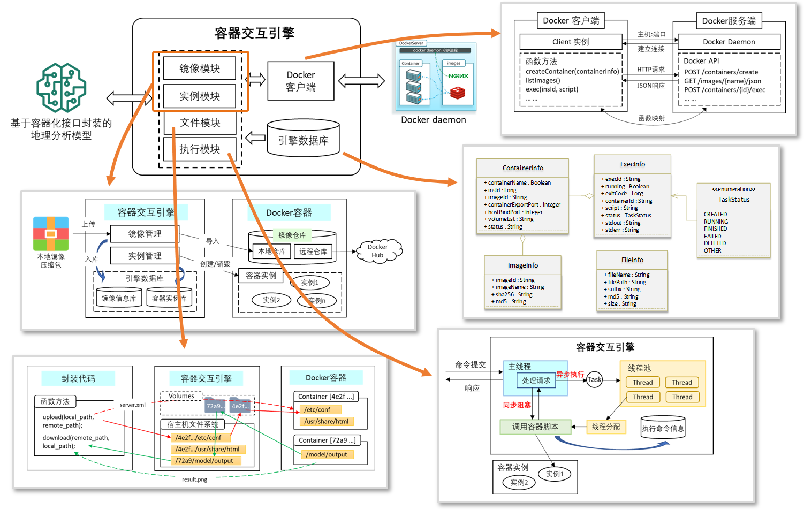
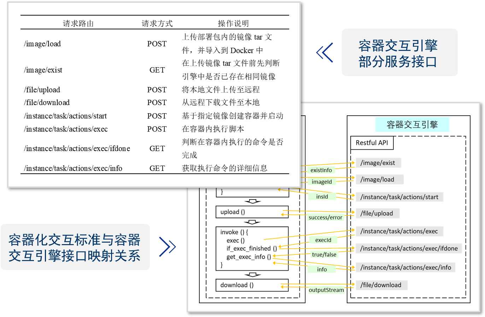

# ContainerEngine

## 介绍
该项目（容器交互引擎）充当了模型封装代码与Docker之间的中间件，它接收交互接口的各种请求并进行相应处理，然后通过调用Docker的API实现与Docker的交互。这种架构使得封装代码与Docker之间的通信变得更加灵活和高效。用户只需关注交互接口的使用，而无需深入了解底层的Docker实现细节，他们只需知道Docker提供了一个独立的环境供模型使用即可。

## 模型封装脚本SDK
**封装示例** 👉 [encapsulation.py](https://github.com/chance7bin/ContainerEngine/blob/main/src/main/resources/static/encapsulation/encapsulation.py)
**相关SDK** 👉 [taskcontroller.py](https://github.com/chance7bin/ContainerEngine/blob/main/src/main/resources/static/encapsulation/taskcontroller.py)

## 交互引擎API

| 请求路由                           | 请求方式 | 操作说明                                          |
| ---------------------------------- | -------- | ------------------------------------------------- |
| /image/load                        | POST     | 上传部署包内的镜像tar文件，并导入到Docker中       |
| /image/exist                       | GET      | 在上传镜像tar文件前先判断引擎中是否已存在相同镜像 |
| /file/upload                       | POST     | 将本地文件上传至远程                              |
| /file/download                     | POST     | 从远程下载文件至本地                              |
| /instance/task/actions/start       | POST     | 基于指定镜像创建容器并启动                        |
| /instance/task/actions/exec        | POST     | 在容器内执行脚本                                  |
| /instance/task/actions/exec/ifdone | GET      | 判断在容器内执行的命令是否完成                    |
| /instance/task/actions/exec/info   | GET      | 获取执行命令的详细信息                            |

## 模型与容器交互方法设计（图示）

### 脚本调用结构化描述

### 模型容器化交互标准设计

------

## 容器交互引擎设计

------

------

